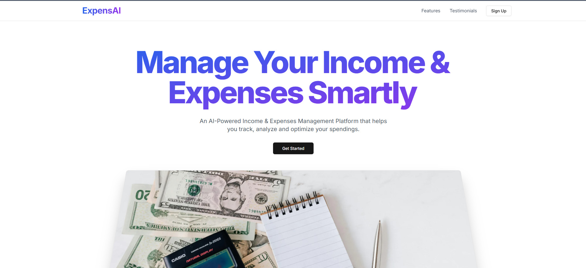
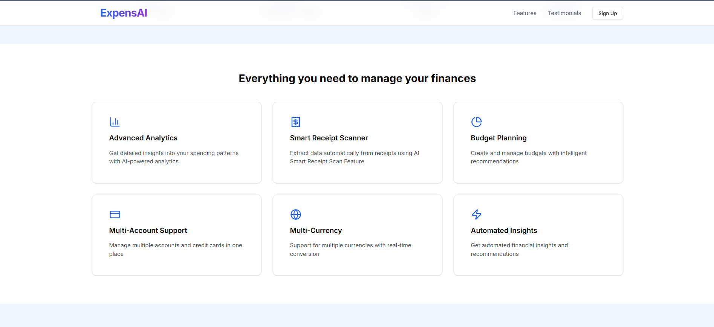
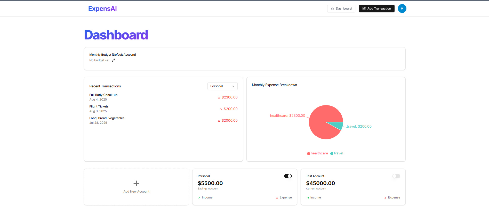
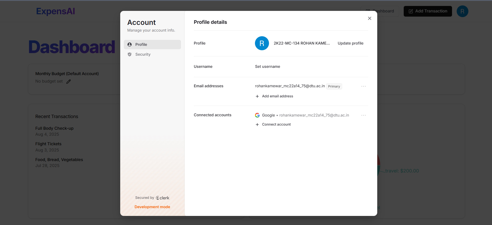
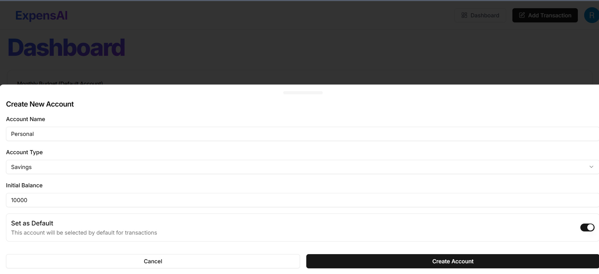
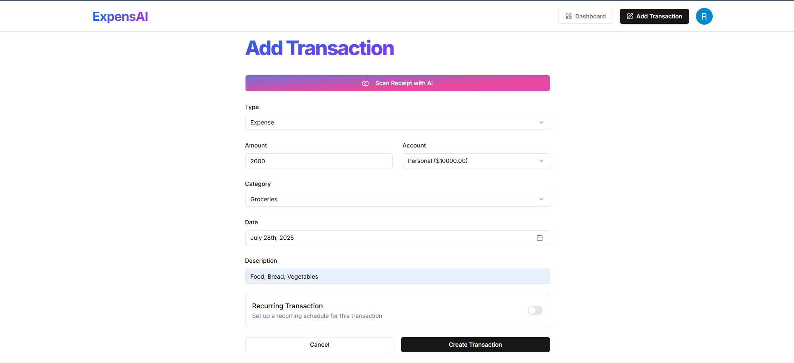
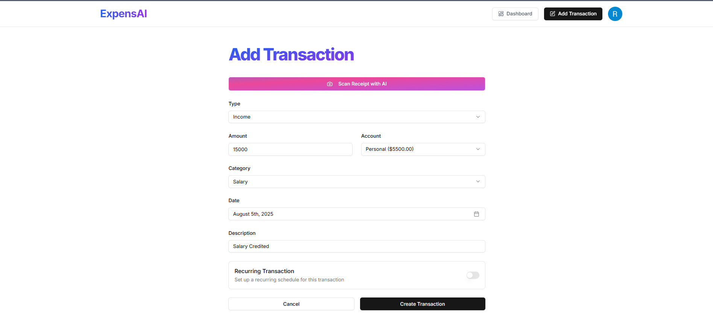
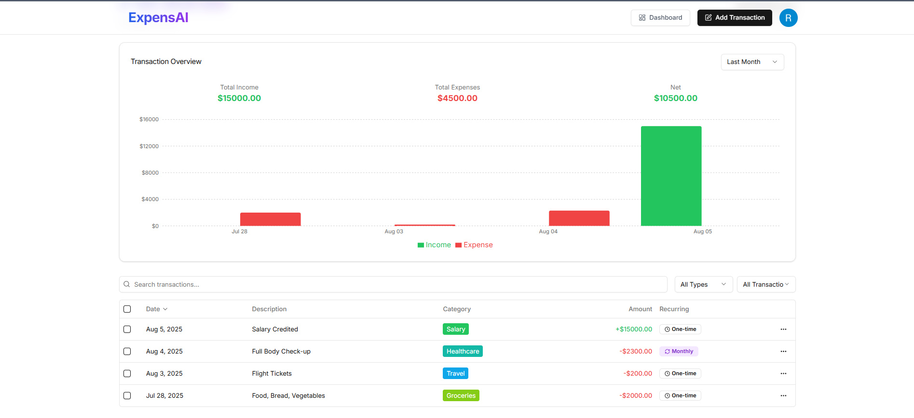

# ExpensAI: Income & Expenses Management Platform

ExpensAI is a modern, full-stack web application designed to help users intelligently track, manage, and optimize their income and expenses using the power of AI.

* Engineered a full-stack AI finance platform on Next.js and Supabase (Postgres), featuring smart receipt scanning for automated transaction entry, AI-driven expense categorization across 10+ distinct categories, and multi-account budget management.
* Implemented secure user authentication with Clerk (including Google OAuth) and fortified the application with Arcjet for bot protection, security, and rate limiting.
* Developed interactive financial dashboards with Recharts and utilized Inngest for scheduling cron jobs to send users AI-powered monthly reports and insights via Resend.

## ✨ Core Features
* **Smart Transaction Tracking:** Easily add transactions manually, set up recurring income/expenses, or use the AI-powered receipt scanner for automated entry.
* **AI-Powered Categorization:** Intelligently categorizes your spending into 10+ distinct categories to provide a clear financial overview.

* **Interactive Dashboards:** Visualize your financial health with dynamic and interactive charts and graphs, powered by Recharts.
* **Budget Management:** Create custom budgets for different categories and track your spending against them to stay on top of your financial goals.
* **Secure Authentication:** Robust and secure user login system with passwordless and Google OAuth options, powered by Clerk.
* **Automated Notifications:** Receive transactional emails, monthly spending reports, and AI-driven insights directly in your inbox, handled by React Email and Resend.
* **Robust Security:** Protected against malicious bots, rate-limiting abuse, and common web threats using Arcjet.
* **Scheduled Background Jobs:** Utilizes Inngest to run cron jobs for tasks like generating and sending monthly reports automatically.

## 🛠️ Tech Stack
* **Category:** Technology
* **Framework :** Next.js (App Router)
* **UI:** Shadcn UI, Tailwind CSS, Recharts
* **AI API:** Gemini AI
* **Authentication:** Clerk
* **Database:** Supabase (Postgres), Prisma (ORM)
* **Security:** Arcjet
* **Background Jobs:** Inngest
* **Email Service:** React Email, Resend

## PROJECT UI

